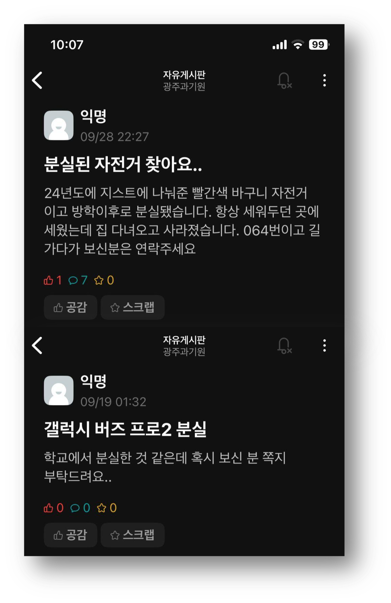
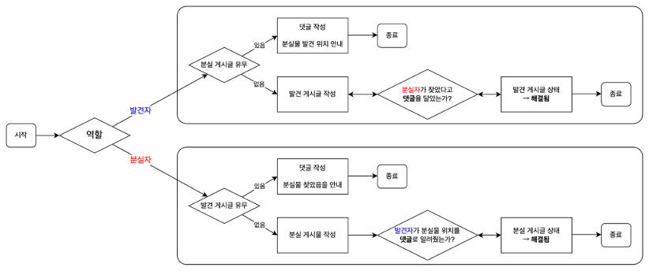
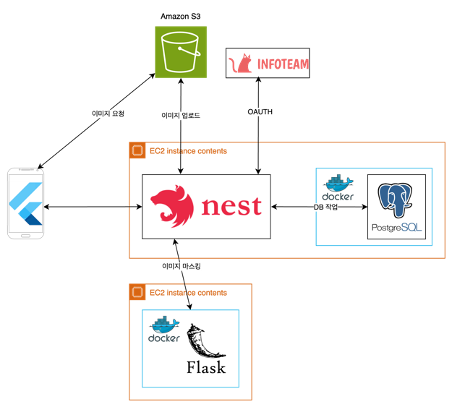
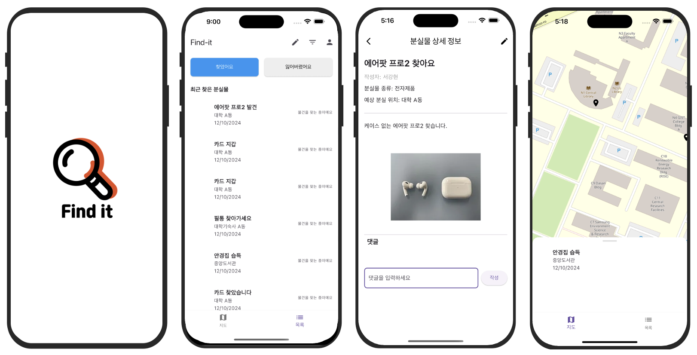
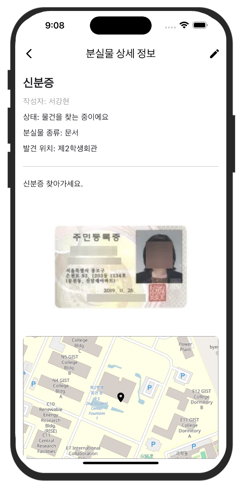
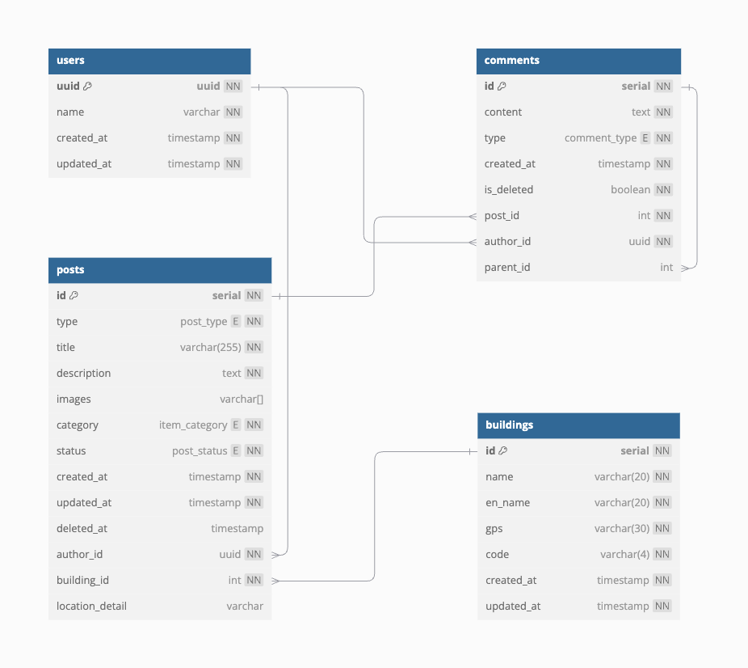

# FIND-IT

이 프로젝트는 GIST의 강의 `서비스 러닝 프로젝트(CT4504)` 수업을 통해 진행되었습니다.

팀 명: 왕밤빵

서비스 명: FIND-IT

[최종 발표자료](https://docs.google.com/presentation/d/1lVEvSlUfGrflweAkulc96JLYfdYYLb29/edit?usp=sharing&ouid=114149998850712867723&rtpof=true&sd=true)

# 1. 프로젝트 주제

## 용어 정의

- 분실자: 물건을 분실한 사람
- 분실게시글: 분실자가 게시한 글

- 발견자: 분실물을 발견한 사람
- 발견게시글: 발견자가 게시한 글

## 문제의식

**| GIST 내 공식적인 분실물 찾기-찾아주기 플랫폼의 부재**

GIST 원내에서는 물건을 분실하는 일이 매일 발생하고 있습니다. 특히 아래 사진에서 볼 수 있는 것처럼 대학생 커뮤니티 서비스 `에브리타임`에는 매일 적게는 2-3회, 많게는 8-9회에 이르기까지 많은 분실물이 발생하고 있습니다.

자신의 물건을 분실한 사람(분실자)들은 주로 다음과 같은 3가지 경로를 통해 분실물을 찾게 됩니다.

1. 에브리타임 게시판에 **분실 게시글** 업로드
2. 각 건물 관리 사무실 문의(기숙사 사감실 방문 포함)
3. 카카오톡 단체 톡방

분실물을 발견한 사람(발견자)들은 대부분 다음의 2가지 경로를 통해 발견한 분실물을 처리합니다.

1. 에브리타임 게시판에 **발견 게시글** 업로드
2. 분실물을 발견한 건물의 관리 사무실에 맡김

이로부터 다음과 같은 문제가 발생합니다.

1. 분실물 관련 정보가 에브리타임 게시판, 카카오톡 단체 톡방, 각 건물 관리 사무실로 분산됩니다.

   - 에브리타임과 카카오톡 단체 톡방은 분실물을 찾거나 찾아주기 위해 이용하는 서비스가 아니기 때문에 분실물 관련 정보가 누락되거나 빠르게 묻힐 수 있습니다.
   - GIST 내에는 여러 건물이 있기 때문에 각 건물의 관리 사무실을 분실자가 직접 돌아다니며, 분실물 내역을 확인해야하는 번거로움이 있습니다.
   - 결국 분실자는 분실물을 발견할 때까지 별도의 시간을 내어 여러 매체와 장소를 돌아다녀야 하는 불편함 겪게 됩니다.

2. 분실자의 개인정보가 노출될 수 있습니다.
   - 신용카드나 주민등록증, 학생증의 경우 금융정보, 주민등록번호, 학번, 얼굴 사진 등의 개인정보가 기재되어 있습니다.
   - 발견자가 위와 같은 분실물을 에브리타임이나 카카오톡 단체 톡방에 분실물 사진과 함께 업로드하게 되면, 개인정보 노출의 위험이 있습니다.

정리하자면, GIST 대학 내에서 분실물을 위해 존재하는 플랫폼이 없으며, 기존 서비스(에타, 카카오톡 등)를 사용할 시 개인정보 노출의 위험이 있다는 것입니다.

## 아이디어 뼈대

위에서 정의한 문제를 토대로, 다음과 같은 아이디어를 기획했습니다.

1. 대학이나 건물 단위의 `분실물 찾기 & 찾아주기` 서비스를 제공하는 플랫폼을 만들자
2. 개인정보 노출 위험이 있는 물품에 대해 `개인정보 Masking` 기능을 제공하자
3. 분실물 플랫폼의 특성에 맞게 `웹`보다 `모바일앱` 플랫폼을 제공해야 한다.

저희 팀은 3가지 아이디어 뼈대를 기반으로 FIND-IT 서비스를 개발했습니다.

궁극적으로는 각 대학과 건물 단위에서 사용할 수 있는 서비스를 목표로 하나, 이번 프로젝트에서는 그 범위를 GIST로 한정해서 서비스를 개발했습니다.

# 2. 서비스 플로우

## 간단한 기능 설명

1. 기본적인 `회원가입`, `로그인` 서비스를 지원합니다.

   - 게시판에 게시글을 업로드하기 위해서는 회원가입과 로그인이 필수입니다.

2. 메인 기능은 `게시판` 입니다.

   - FIND-IT은 넓게 봤을 때 `게시판 플랫폼`입니다.
   - 사용자는 게시판에 게시글을 올릴 수 있으며, 분실물과 관련된 정보를 게시할 수 있습니다.
   - 게시글에는 `게시글 유형`, `제목`, `상세 설명`, `이미지`, `발견위치(건물, 상세설명)`, `카테고리`를 입력할 수 있습니다.

3. 사용자는 게시글에 `댓글`을 달 수 있습니다.
   - 사용자는 분실물과 관련된 정보를 게시글 댓글에 남길 수 있습니다.
   - 댓글에 댓글을 다는 `대댓글` 기능도 제공합니다.
   - 댓글은 `텍스트`로 제한됩니다.

## 서비스 플로우

기본적인 회원가입, 로그인 등의 과정은 제외되며, 여기서는 핵심 서비스 플로우에 대해서만 설명합니다.

FIND-IT 사용자는 분실물을 발견할 시 `발견자`로, 자신의 물품을 분실할 시 `분실자`로 정의됩니다.

### 발견자 관점

`발견자`는 분실물 발견 시, 해당 분실물에 대한 `분실 게시글` 존재 여부를 확인합니다.

1. 만약 `분실 게시글`이 없는 경우

   `발견자`는 발견 게시글을 작성합니다. 발견한 분실물에 관련된 정보(카테고리, 사진, 발견 장소 등)를 기입하고 `발견 게시글`을 업로드합니다.

   이후 해당 분실물을 분실한 `분실자`가 업로드된 `발견 게시글`에 해당 분실물을 찾았음을 `댓글`로 남긴 것을 확인하면, `발견 게시글`의 상태를 `해결됨`으로 수정하며 **서비스 플로우**가 종료됩니다.

2. 만약 `분실 게시글`이 있는 경우

   `발견자`는 별도의 `발견 게시글`을 작성하지 않아도 됩니다. 해당 `분실 게시글`의 `댓글`에 `발견자`가 발견한 분실물의 위치와 정보를 댓글로 남겨주면 `발견자`의 **서비스 플로우**는 종료됩니다.

### 분실자 관점

`분실자` 관점의 서비스 플로우는 `발견자` 관점의 그것과 크게 다르지 않습니다. 역할이 바꼈을 뿐, **전체적인 흐름은 동일**합니다.

`분실자`는 자신의 물품을 분실할 시, 해당 분실물에 대한 `발견 게시글` 존재 여부를 확인합니다.

1. 만약 `발견 게시글`이 없는 경우

   `분실자`는 분실 게시글을 작성합니다. 잃어버린 분실물에 관련된 정보(카테고리, 사진, 분실 예상 장소 등)를 기입하고 `분실 게시글`을 업로드합니다.

   이후 해당 분실물을 발견한 `발견자`가 업로드된 `분실 게시글`에 해당 분실물을 발견한 장소를 `댓글`로 남긴 것을 확인하면, 해당 위치의 `분실물`을 찾고, `분실 게시글`의 상태를 `해결됨`으로 수정하며 **서비스 플로우**가 종료됩니다.

2. 만약 `분실 게시글`이 있는 경우

   `발견자`는 별도의 `발견 게시글`을 작성하지 않아도 됩니다. 해당 `분실 게시글`의 `댓글`에 `발견자`가 발견한 분실물의 위치와 정보를 댓글로 남겨주면 `발견자`의 **서비스 플로우**는 종료됩니다.

# 3. 서비스 아키텍쳐 및 백엔드 주요 기능

## 서비스 아키텍쳐

1. **인증 및 인가 (OAUTH)**

   인증, 인가에는 GIST 대학 총학생회 정보국, GSA INFOTEAM에서 제공하는 IdP Service를 사용하였습니다. GIST 구성원들을 대상으로 서비스를 제공하는 만큼, 카카오톡이나 구글 등의 소셜 로그인이 아니라 GIST 구성원들만 사용 가능한 Idp Service를 채택했습니다. GSA INFOTEAM Idp Service는 OAuth2.0 표준 프로토콜을 따릅니다.

   참고로, FIND-IT은 GSA INFOTEAM 외에 해당 IdP Service를 인증 및 인가에 사요한 첫 번째 프로젝트입니다.

   GSA INFOTEAM Idp Serivce와 관련된 문서는 [여기](https://infoteam-rulrudino.notion.site/GSA-OAuth2-OIDC-fa09594e4b2548758e1343c84d7da008)에서 확인하실 수 있습니다.

2. **NestJS**

   백엔드 서비스 프레임워크로 NestJS를 사용했습니다. NestJS 사용법에 조언을 줄 수 있는 팀원들이 있으며, 본인은 프론트엔드 경험과 Node.js에 대한 기본 지식이 있기 때문에 빠르게 NestJS를 학습할 수 있어 NestJS를 채택했습니다.

3. **PostgreSQL**
   Database 선택 옵션에 SQLite, MySQL, PostgreSQL를 고려했습니다. 프로젝트 규모가 크지 않아 SQLite를 고려했지만, 현업에서 더 중요하게 사용되는 MySQL과 PostgreSQL를 후보군으로 선정했습니다.

   이미 PostgreSQL을 사용해서 서비스를 운영 중인 팀원이 있기 때문에 DB 조작 과정에서 문제 해결에 도움을 받기 수월하고자 MySQL이 아닌 PostgreSQL을 Database로 선택했습니다.

4. **Amazon EC2**

   비용상의 문제로 백엔드 서버와 DB 각각을 위한 별도의 EC2 Instance를 생성하지는 않았습니다. NestJS는 pm2를 사용해 실행하였고, docker container로 postgreSQL DB를 띄웠습니다.

5. **Amazon S3**

   사용자가 게시글 업로드시 첨부한 이미지를 Amazon S3 bucket에 저장했습니다.

   **Lifecycle policy**

   게시글 업로드는 1단계. 이미지 업로드(S3) 2단계. 게시글 업로드(DB)로 연이어 구성되어 있으며, 1단계만 이루지고 2단계는 실패한 경우가 발생할 수 있습니다. 이 경우 사용되지 않는 이미지들이 S3 bucket에 불필요하게 저장될 수 있습니다. 이를 방지하기 위해 1단계에서 업로드되는 Object의 tag를 `expiration=true`로, 2단계가 이루어질 경우 해당 Object의 tag를 `expiration=false`로 수정하고, S3의 `Lifecycle Policy`를 사용해 불필요한 이미지(expiration=true)들을 제거했습니다.

   **Presigned URL**
   S3 bucket에 대한 GetOjbect 요청 권한을 관리하기 위해 Presigned URL를 적용했습니다. 이는 FIND-IT 서비스 외의 목적으로 S3 bucket 내 이미지를 사용하는 것을 방지하고, bucket을 private으로 유지하면서도 사용자에게 이미지를 보여주기 위한 의도입니다.

6. **Flutter**

   Mobile APP 프레임워크로 `Flutter`를 사용했습니다. 다른 팀원들이 개발에 관여했습니다. 관련 [레퍼지토리](https://github.com/wang-bam-bbang/find-it-flutter)에서 확인하실 수 있습니다.

7. **Flask**

   개인정보 Masking 기능을 위해 OCR Masking 모델을 사용해 이미지에 대한 Masking 기능을 제공하기 위해 Flask를 사용했습니다. 다른 팀원들이 개발에 관여했습니다. 관련 [레퍼지토리](https://github.com/wang-bam-bbang/find-it-ai)에서 확인하실 수 있습니다.

### Flutter 화면 구성

모바일앱 화면 구성은 다음과 같습니다.

## 백엔드 주요 기능

<strong>Prisma</strong>

FIND-IT 서비스는 `PostgreSQL`을 DB로 사용하며, ORM으로 `Prisma`를 사용한다. 아래 사진은 FIND-IT 서비스의 `DB Schema`를 나타내며, [dbdocs](https://dbdocs.io/%EA%B9%80%EC%B2%A0%ED%9D%AC/find_it)를 통해 좀 더 자세한 내용을 확인할 수 있다.

---

<strong>User</strong>

### 주요 엔드포인트

1. **GSA INFOTEAM IdP로그인 URL 가져오기**:

   - `GET /user/login`
   - IdP 로그인 URL을 반환
   - 모바일앱에서 해당 URL을 사용해 로그인 진행

2. **IdP 로그인 콜백**:

   - `GET /user/callback`
   - 로그인을 끝낸 사용자(모바일앱)으로부터 `IdP 인증 코드`를 받아 `IdP Service`로부터 `JWT 토큰`을 받고, 이를 사용자에게 반환

3. **Access Token 갱신**:

   - `POST /user/refresh`
   - Refresh Token을 사용하여 Access Token 갱신
   - `IdP Service`를 통해 이루어짐

4. **사용자 정보 조회**:
   - `GET /user/info`
   - Access Token을 통해 사용자 정보 반환
   - `IdP Service`를 통해 이루어짐

---

<strong>Post</strong>

### 주요 엔드포인트

1. **게시물 리스트 조회**:

   - `GET /post/list`
   - 여러 필터 옵션을 통해 게시물 리스트 조회
   - 주요 필터 Input: 카테고리, 게시글 유형, 게시글 상태, 건물
   - Cursor-based Pagination 적용

2. **내 게시물 조회**:

   - `GET /post/my-posts`
   - 사용자 본인 게시물 조회

3. **게시물 생성**:

   - `POST /post`
   - 주요 Input: Access Token, 게시글 유형(분실, 발견), 제목, 상세 설명, 이미지 key 리스트, 건물, 상세 위치, 분신물 카테고리
   - 게시글 업로드는 1단계. 이미지 업로드 2단계. 게시글 업로드 과정으로 이루어져있다.
   - 이미지 key 리스트는 1단계에서 반환된 이미지 key 리스트를 사용한다.
   - 2단계에 도달하지 못한 이미지들은 S3 bucket의 Lifecycle Policy에 의해 삭제된다.

4. **게시물 수정**:

   - `PATCH /post/:id`

5. **게시물 삭제**:
   - `DELETE /post/:id`

---

<strong>Image</strong>

### 주요 기능

1. **이미지 업로드(API)**:

   - `POST /image`
   - 여러 개의 이미지를 S3에 업로드
   - 업로드된 이미지의 key 리스트 반환

2. **Presigned URL 생성(service)**:

   - 이미지 key 리스트를 받아 GetObject 명령어에 대한 presigned-url 반환
   - 1시간 유효

3. **Image Masking(service)**:

   - 이미지에 노출된 개인정보를 making한 이미지 반환하는 요청 전달
   - Masking 기능이 있는 외부 서버에 요청을 전달하는 proxy 역할

4. **이미지 검증(service)**:

   - S3에 업로드된 이미지가 게시글 업르도에 사용될 경우, 해당 이미지의 `expiration` tag를 `false`로 수정

---

<strong>Comment</strong>

### 주요 엔드포인트

1. **댓글 생성**:

   - `POST /comment`
   - 게시물에 댓글 생성
   - 주요 Input: 댓글 내용, 댓글 유형(댓글, 대댓글), 게시글 Id, 부모 댓글 Id(optional)

2. **댓글 리스트 조회**:

   - `GET /comment/:postId`
   - 특정 게시물의 댓글 리스트 조회

3. **댓글 삭제**:
   - `DELETE /comment/:commentId`
   - 특정 댓글 삭제

---

<strong>Building</strong>

### 주요 엔드포인트

1. **건물 생성**:

   - `POST /building`
   - 새로운 건물 정보 등록

2. **모든 건물 조회**:

   - `GET /building`

3. **건물 정보 수정**:

   - `PATCH /building/:id`
   - 특정 건물 정보 수정

4. **건물 삭제**:
   - `DELETE /building/:id`
   - 특정 건물 삭제

---

<strong>Swagger 문서화</strong>

Swagger를 사용하여 API 문서를 제공한다.

### 주요 기능

- **OAuth2 인증**: IdP 로그인 및 토큰 발급 지원
- **JWT 인증**: Bearer 토큰 기반의 인증 지원
- **엔드포인트 테스트**: Swagger UI에서 직접 요청 테스트 가능

Swagger API Docs 접근 경로: `/api/docs`

## 4. 팀원별 기여 내용

- [김철희(본인)](https://github.com/Kimcheolhui)
  - 백엔드 로직, DB 설계 및 구현
  - AWS Service(S3, EC2) 조작
  - 프로젝트 중간 발표 담당
- [문건우](https://github.com/melonmat)
  - DB 설계
  - 초기 Post Module 구현
- [서강현](https://github.com/GanghyeonSeo)
  - 모바일앱 담당
  - 백엔드 로직 설계 관여
- [이보성](https://github.com/2paperstar)
  - 모바일앱 담당
  - 백엔드 로직 설계 관여
- [이재희](https://github.com/jaehee831)
  - AI 모델 활용한 Masking 기능 개발 및 배포
  - 최종 프로젝트 발표 담당

## 5. 회고

### 채팅 기능을 개발하지 않은 이유

기존 기획에서는 채팅 기능을 개발할 예정이었다. 단순하게 생각했을 때, 물건을 찾고 찾아주는 과정에서 채팅 기능이 꼭 필요할 것으로 생각했다. 하지만 다음과 같은 이유로 대부분의 경우에는 채팅 기능이 필요하지 않다는 결론을 내렸다.

a. 발견자의 입장에서, 분실물을 발견할 경우 분실 게시글에 분실물 발견 장소를 댓글로 남기거나, 발견 게시글을 업로드하고 나면, 그 이후에 발견자-분실자 사이의 대화는 불필요하다.

b. 분실자의 입장에서, 자신의 분실물에 대한 바견 게시글을 발견할 경우, '감사인사' 외에 발견자-분실자 사이의 대화는 불필요하다.

c. 설령 발견자-분실자 사이의 대화가 이루어진다고 할지라도, `대화의 지속성`이 매우 짧아 채팅 기능이 무의미하다.

d. 댓글 기능이 발견자-분실자 사이의 모든 대화를 커버할 수 있다.

위와 같은 이유로 댓글 기능으로도 채팅 기능을 구현함으로써 얻을 수 있는 이점(발견자-분실자간 대화)를 충분히 얻을 수 있다는 결론에 다달았으며, 기존 댓글 기능에 `대댓글` 기능을 추가하여 댓글 기능을 통한 대화 편의성을 높이고자 했다.

### DB를 EBS에 연결하지 않은 것

현재 PostgreSQL DB는 docker container의 내부 파일 시스템에 연결되어 있다. 이는 EC2 instance 자체 volume에 연결되어 있기 때문에, container가 종료(의도적이든 실수든)되면 DB의 data는 사라지게 된다.

프로젝트를 진행하는 동안 EC2 instance가 종료해야하는 일이 발생하지 않아 별도의 문제는 없었으나, 만약 그러한 상황이 있었다면 DB의 data가 사라졌을 것이다.

docker container의 volume을 EC2 instance 자체 volume에 연결하는 것이 아니라, EC2 instance에 mount된 EBS에 연결했어야 한다. docker container의 volume을 EBS에 연결한다면 설령 EC2 instance가 갑작스럽게 종료된다고 할지라도, DB의 data는 EBS에 그대로 보존되게 된다.

이에 대한 배경 지식이 있었지만 초기에 조치를 취하지 않은 것이 문제이다.

### 백엔드 개발 재밌다!

프론트엔드 개발자로서는 여러 번 개발 프로젝트에 참여한 경험이 있지만, 백엔드 개발자로서는 처음이다. 백엔드 개발자의 진로를 택하기로 결심하고 나서 처음으로 진행한 프로젝트인데, 학기 중임에도 불구하고 나름 의미있는 백엔드 경험을 할 수 있었다. DB와 API 설계는 어떻게 해야하는지, 디자인 패턴이 왜 중요한지, 의존성 주입과 데코레이터가 무엇인지, DB migration이 왜 중요한지, 자동 배포가 왜 필요한지 등, 단순히 CS 전공 수업만으로는 알 수 없는 경험을 했다.

한 가지 아쉬운 점은 백엔드 배포가 이뤄지긴 했지만, 모바일앱 등록을 하지 않아 실 사용자가 없었다는 점이다. 개발해둔 API endpoint들도 모두 사용되지는 못했다. 개개인이 이 프로젝트에 뜻이 있어서 팀으로 결성된 게 아니기 때문에, 프로젝트의 고도화는 이루어지기 어려웠다. 내 계획으로는 조만간 새로운 프로젝트를 시작해볼 생각인데, 그 때는 실제 배포와 운영까지 이루어지고, 최초 배포된 서비스에서 고도화까지 이루어지는 경험일 해볼 수 있기를 바란다.
